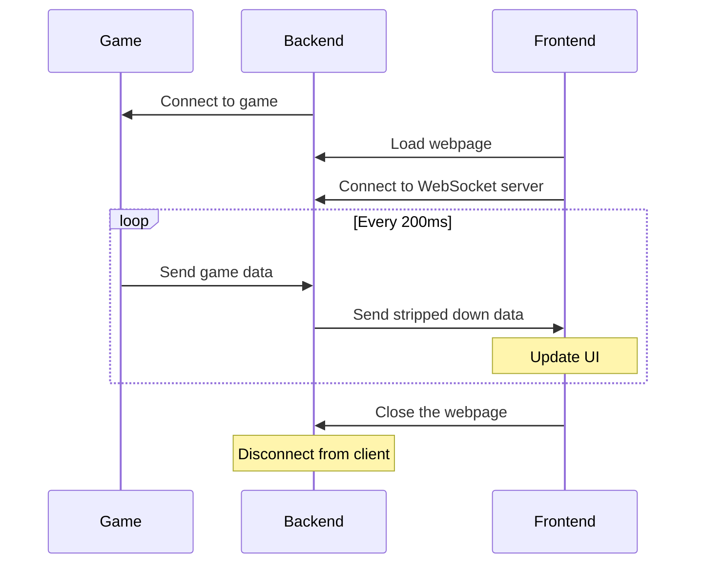

# SCS Telemetry WebApp

## Table of contents

- [Table of contents](#table-of-contents)
- [Summary](#summary)
- [Installing instructions](#installing-instructions)
- [Building instructions](#building-instructions)
- [How does it work](#how-does-it-work)
    - [Process diagram](#process-diagram)
    - [Getting data from the game](#getting-data-from-the-game)
    - [Displaying game data](#displaying-game-data)

## Summary

The intent of this project is to build a web app that displays in-game data for [Euro Truck Simulator 2](https://store.steampowered.com/app/227300/Euro_Truck_Simulator_2/) by connecting to the game via the [game SDK](https://modding.scssoft.com/wiki/Documentation/Engine/SDK/Telemetry).

The project is inspired by [kniffen](https://github.com/kniffen)'s [TruckSim-Telemetry](https://github.com/kniffen/TruckSim-Telemetry)

## Installing instructions

1. Download the prebuild `.exe` from the releases section
2. Run the program `SCS_Telemetry_WebApp.exe`
3. Open the game
4. Open a web browser and navigate to `localhost:8080` or `[ip of the computer running the program here]:8080`

---

## Building instructions

1. Clone the repository locally: `git clone --recurse-submodules https://github.com/Azkel1/SCS_Telemetry_WebApp`
2. Download the [SDK `.dll`](https://github.com/RenCloud/scs-sdk-plugin/releases/latest) from RenCloud's repo
3. Place the downloaded `.dll` inside the game's `bin\win_(x64|x86)\plugins` folder
4. Open the solution in Visual Studio
5. Run `npm i` inside the project (to install [gulp](https://gulpjs.com/), used to copy frontend output on build)
6. Check if you can build the program correctly

---

## How does it work

### Process diagram

### Getting data from the game

A C# app to connect to the game by using the [RenCloud's implementation](https://github.com/RenCloud/scs-sdk-plugin) of the game SDK.

This same C# app serves a Web Socket server to transmit the data to the server and a HTTP server to host the frontend.

To be able to access both servers on the same IP and port a reverse proxy is used.

The SDK contains types that define the structure of the data received from the game, these types are converted to Typescript using [Reinforced Typings](https://github.com/reinforced/Reinforced.Typings).

### Displaying game data

The data is displayed on a static web page made with [SvelteKit](https://kit.svelte.dev) and [Open Props](https://open-props.style/). On startup it connects to the Web Socket server created by the backend and saves the received data inside a [store](https://svelte.dev/docs/svelte-store). This store is then used to update the UI.

Currently the UI only supports portrait screens (mainly designed for phones but on desktop you can use the responsive viewer or resize the browser window).